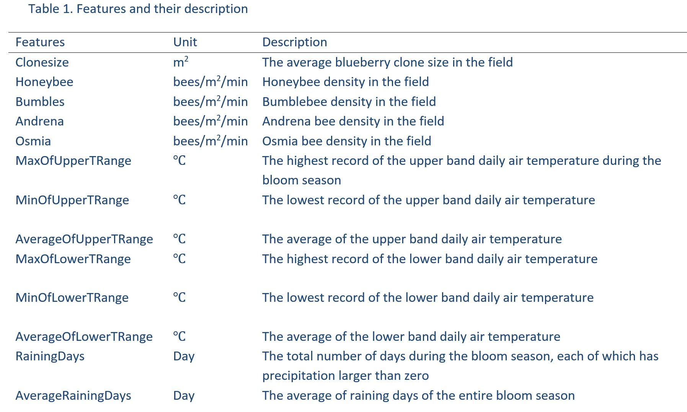

## Introduction

For our Final Project, we will be attempting to predict the yield of wild blueberries. These are known as "lowbush berries", which grow on low-level bushes and are typically pea-sized. Our dataset can be found at **https://www.kaggle.com/datasets/saurabhshahane/wild-blueberry-yield-prediction** . This data was generated by a simulation model called the Wild Blueberry Pollination Model, which has been validated by experimental data collected in the State of Main over the last 30 years.

Generally, in the field of agriculture, an increasing quantity of research has gone underway to understand the determinants of crop yield. Machine learning has enabled scientists and farmers to investigate which factors have the greatest impact on crop yield. In this specific case, the crop of interest is the wild blueberry. The paper for which this data was created is called "Simulation-based modeling of wild blueberry pollination". It was published in the January 2018 version of *Computers and Electronics in Agriculture*. The paper can be found at: **https://www.sciencedirect.com/science/article/pii/S0168169916310274?via%3Dihub** .

## Handling Data

Below the dataset will be loaded from a .csv file. The `tidyverse` library has been loaded so that the data will automatically be loaded as a tibble, which provides some advantages over a standard data frame. One advantage being that the `read_csv` function will automatically assign types to each column in the tibble.

```{r, eval = TRUE, message=FALSE, warning=FALSE}

library(tidyverse)
data = read_csv("blueberryData.csv")
colnames(data)
dim(data)

```

The dataset contains 18 columns and 777 observations. Along with downloaded the dataset from Kaggle, we downloaded the descriptions of the predictor variables in the dataset.



There are 13 predictor variables in the dataset. Their information includes clone size (size of bush), bee density by species, temperature, and precipitation. `fruitset, fruitmass, seeds`, and `yield` are all response variables. All predictor and response variables are quantitative. There are no qualitative variables. `Row#` can be deleted because it serves no purpose.

```{r, eval = TRUE, message=FALSE, warning=FALSE}
data = select(data, -'Row#')
dim(data)
```

The dataset does not have any `NA` values. We also will not need to convert any columns into factors, since there is no categorical data.

```{r, eval = TRUE, message=FALSE, warning=FALSE}
sum(is.na(data))
```

## Exploration

A look at the density plots of 9 of our predictor variables shows that none of the distributions are approximately normal. Although this will not be detrimental to our algorithms, this was a surprise considering this is a simulation of natural factors (temperature, bees, precipitation). 

```{r, eval = TRUE, message=FALSE, warning=FALSE}
library(gridExtra)

plot1 = ggplot(data, aes(clonesize)) + geom_density()
plot2 = ggplot(data, aes(honeybee)) + geom_density() + xlim(0, 1)
plot3 = ggplot(data, aes(bumbles)) + geom_density()
plot4 = ggplot(data, aes(andrena)) + geom_density()
plot5 = ggplot(data, aes(osmia)) + geom_density()
plot6 = ggplot(data, aes(AverageOfUpperTRange)) + geom_density()
plot7 = ggplot(data, aes(AverageOfLowerTRange)) + geom_density()
plot8 = ggplot(data, aes(RainingDays)) + geom_density()
plot9 = ggplot(data, aes(AverageRainingDays)) + geom_density()

grid.arrange(plot1, plot2, plot3, plot4, plot5, plot6, plot7, plot8, plot9, ncol = 3)
```

## Prediction

We will attempt to predict `yield` with the given predictor variables in the dataset. We chose `yield` as opposed to the other response variables because it is measured in quantity of blueberries, which we felt to the most important measure of a harvest.

Before beginning any machine learning algorithms, we decided to only retain `AverageOfLowerTRange` and `AverageOfUpperTRange` amongst out six temperature variables. The researchers used historical weather data to simulate the ranges of temperatures. Because of this we are comfortable using these two variables as our high and low temperatures. Our decision to remove these variables will simplify the model, and minimize multicolinearity. This will result in 9 predictor variables for our modeling.

```{r, eval = TRUE, message=FALSE, warning=FALSE}
data = select(data, -c(MaxOfUpperTRange, MinOfUpperTRange, MaxOfLowerTRange, MinOfLowerTRange))
dim(data)
```

We will also create training and test sets from our data before starting our modeling. Out split will be 70% training, 30% testing.

```{r, eval = TRUE, message=FALSE, warning=FALSE}
set.seed(42)
train = sample(c(TRUE, FALSE), size = nrow(data), prob = c(0.7, 0.3), replace = TRUE)
traindata = data[train, ]
testdata = data[!train,]
```


### Multiple Linear Regression

Our first method will be

### Ridge Regression

```{r}
library(glmnet)
train.test = model.matrix(yield~., data = traindata)
x.test = model.matrix(yield~., data = testdata)

     
# Finding lambda chosen by cross-validation
set.seed(42)
ridge.cv = cv.glmnet(train.test, traindata$yield, alpha = 0)
lambda.ridge = ridge.cv$lambda.min
lambda.ridge
plot(ridge.cv)

#Fitting to ridge regression
ridge.fit = glmnet(train.test, traindata$yield, alpha = 0, lambda = lambda.ridge)
coef(ridge.fit)

#Mean square error
ridge.pred = predict(ridge.fit, newx=x.test, s = lambda.ridge)
mean((testdata$yield - ridge.pred)^2)
```
### Lasso Regression

```{r}
# Finding lambda chosen by cross-validation
set.seed(42)
lasso.cv = cv.glmnet(train.test, traindata$yield, alpha = 1)
lambda.lasso = lasso.cv$lambda.min
lambda.lasso
plot(lasso.cv)

#Fitting to lasso regression
lasso.fit = glmnet(train.test, traindata$yield, alpha = 1, lambda = lambda.lasso)
coef(lasso.fit)

#Mean square error
lasso.pred = predict(lasso.fit, newx=x.test, s = lambda.lasso)
mean((testdata$yield - lasso.pred)^2)
```

There are 11 non-zero coefficient estimates in the lasso regression